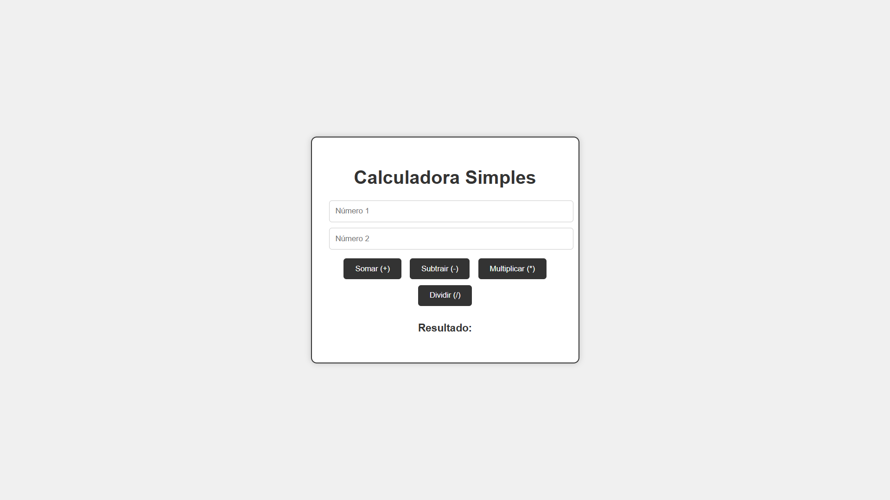

# Calculadora Simples

Projeto desenvolvido com o objetivo de praticar lógica de programação e manipulação do DOM utilizando JavaScript.

# Tecnologias utilizadas
- HTML5
- CSS3
- JavaScript

## Funcionalidades
- Operações básicas (soma, subtração, multiplicação e divisão)
- Interface simples e intuitiva
- Interação com o usuário via botões

## Aprendizados
- Manipulação do DOM
- Eventos em JavaScript
- Organização de código

  

